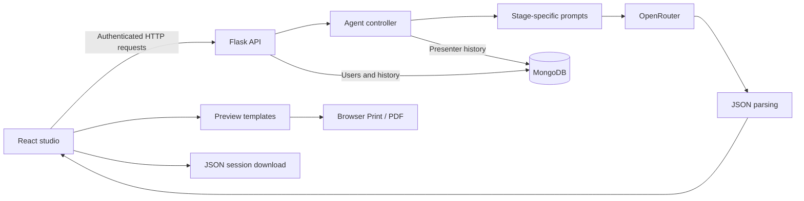

# autonomous-studio

**A four-stage AI workspace for turning a topic into concepts, critiques, refinements, and an executive presentation.**

autonomous-studio pairs a React interface with a Flask API and MongoDB persistence. A user supplies a topic, chooses a prompt style and model configuration, and follows a sequential workflow: **Idea → Critic → Refiner → Presenter**. The resulting content can be inspected in the studio, viewed through three presentation layouts, downloaded as a JSON session, or printed through the browser.

The agents are specialized prompt-driven stages. They pass structured output from one stage to the next; the application does not implement a background autonomous planner, tool-execution loop, or parallel agent runtime.

> **Status:** development prototype. The repository includes the UI, API, authentication, history storage, and OpenRouter integration. Model availability depends on the external provider. Existing authorization and workflow gaps are documented under [Known limitations](#known-limitations); review these before considering a public deployment.

## Contents

- [What the application does](#what-the-application-does)
- [Architecture and execution](#architecture-and-execution)
- [Quick start](#quick-start)
- [Configuration](#configuration)
- [Models and prompt styles](#models-and-prompt-styles)
- [API reference](#api-reference)
- [Persistence and exports](#persistence-and-exports)
- [Repository map](#repository-map)
- [Development and verification](#development-and-verification)
- [Known limitations](#known-limitations)
- [Troubleshooting](#troubleshooting)
- [License and attribution](#license-and-attribution)

## What the application does

| Area | Implemented behavior |
| --- | --- |
| Creative workflow | Four sequential stages produce ideas, evaluate them, refine them, and prepare a final summary. |
| Model selection | The UI supports one model for all stages or separate selections per stage. The backend defines five model aliases. |
| Prompt styling | Five styles change the tone and structure requested from each model. |
| Preview | Executive, Detailed, and Minimal React templates with a configurable accent color. |
| Export | JSON session download and browser Print/PDF. No dedicated HTML, Markdown, text, or server-generated PDF export is implemented. |
| Accounts | Registration, login, profile/preferences management, account activation/deactivation, and role-gated routes. |
| History | Presenter-stage requests attempt to save a per-user history entry; entries can be listed, inspected, and deleted. |

### The four stages

| Stage | Input | Requested output |
| --- | --- | --- |
| Idea | Topic and style | Three concepts with descriptions, innovation points, benefits, tags, feasibility, and novelty. |
| Critic | Topic and concepts | Strengths, weaknesses, market viability, implementation challenges, suggestions, and risk assessments. |
| Refiner | Topic, concepts, and critiques | Revised concepts, improvements, risk mitigations, enhanced features, and implementation steps. |
| Presenter | Topic and refined concepts | Executive summary, recommendation, selected concept, success metrics, and next steps. |

These structures are requested in prompts, not enforced by a response schema. The JSON parser removes code fences and tries to recover an object from surrounding text; valid JSON does not guarantee the expected fields or types.

## Architecture and execution



### Browser-orchestrated workflow

[`client/src/pages/Studio.jsx`](client/src/pages/Studio.jsx) makes four requests in sequence to `/api/ai/agents/idea`, `/critic`, `/refiner`, and `/presenter`. Each stage receives the relevant output from the preceding stages. Progress updates appear after completed requests; responses are not token-streamed.

Single-model mode synchronizes the per-stage selections. Multi-model mode permits different aliases per stage. Each request includes `agent` and `promptStyle`; the server resolves the alias and generates the stage-specific prompt.

### Separate server workflow

`POST /api/studio/run` invokes [`run_complete_workflow`](server/controllers/studio_controller.py). This is a different execution path: it uses the `gemini` alias for all four stages, does not honor per-stage model selection, and does not save a history entry. The browser's main studio flow calls the individual agent routes instead.

### Technology

| Layer | Repository configuration |
| --- | --- |
| UI | React 19, React Router 7, Lucide icons |
| Styling | Tailwind CSS 4 through the Vite plugin |
| Build | Vite 7, npm lockfile, ESLint 9 |
| API | Python, Flask 3, Flask-CORS |
| Storage | MongoDB through PyMongo |
| Authentication | HS256 JWTs through PyJWT; password hashes through Werkzeug |
| Model access | Blocking HTTP requests to OpenRouter's chat-completions endpoint |

The backend lists additional SDK and machine-learning dependencies, but the active model-call path uses `requests` and OpenRouter rather than direct vendor SDKs.

## Quick start

### Prerequisites

- Node.js compatible with Vite 7: **20.19+ or 22.12+**, and npm.
- Python **3.11+** for the documented setup. No Python version is declared in package metadata; the repository's pinned dependencies must support your chosen interpreter.
- A running local MongoDB server or an accessible MongoDB deployment.
- An OpenRouter API key and access to at least one configured model.

### 1. Clone

```bash
git clone https://github.com/quixoticalcoder/autonomous-studio.git
cd autonomous-studio
```

### 2. Configure and start the backend

```bash
cd server
python3 -m venv .venv
source .venv/bin/activate
python -m pip install -r requirements.txt
cp .env.example .env
```

Edit `server/.env` with your MongoDB connection, OpenRouter key, and a long random JWT secret. Start MongoDB before starting Flask: the database manager attempts a connection during module import.

```bash
python -m flask --app app run --debug --host 127.0.0.1 --port 5000
```

The API is available at `http://localhost:5000/api`. The Flask CLI is used here to bind local development to loopback; `python app.py` instead uses the file's configured debug server on `0.0.0.0:5000`.

For Windows PowerShell, create the environment with `py -3.11 -m venv .venv`, activate with `.\.venv\Scripts\Activate.ps1`, and copy configuration with `Copy-Item .env.example .env`.

### 3. Configure and start the frontend

From the repository root in another terminal:

```bash
cd client
npm ci
cp .env.example .env
npm run dev
```

The client template contains:

```dotenv
VITE_API_BASE=http://localhost:5000/api
```

Open the URL printed by Vite, normally `http://localhost:5173`. Register or sign in, enter a topic, select a prompt style and supported model, and run the workflow. Change model mappings if your OpenRouter account cannot access the configured IDs.

### 4. Check basic connectivity

```bash
curl http://localhost:5000/api/health
curl http://localhost:5000/api/config/models
curl http://localhost:5000/api/config/styles
```

The health response contains `status`, `service`, `version`, `availableModels`, and `availableStyles`. It is a static service response, not an ongoing MongoDB or OpenRouter readiness check.

## Configuration

| Variable | Location | Purpose |
| --- | --- | --- |
| `MONGODB_URI` | `server/.env` | MongoDB connection; defaults to `mongodb://localhost:27017/`. |
| `DATABASE_NAME` | `server/.env` | Defaults to `autonomous_studio`, the database-safe project identifier. |
| `OPENROUTER_API_KEY` | `server/.env` | Credential used by all model requests. |
| `JWT_SECRET_KEY` | `server/.env` | JWT signing secret; replace the example before running with real accounts. |
| `VITE_API_BASE` | `client/.env` | API root, including `/api`, for the studio, authentication, and history pages. |

Environment examples contain placeholders only. Local `.env` files are excluded from Git. Never put provider credentials or signing secrets into `VITE_*` variables: client variables are bundled into browser code.

An existing installation can retain its database by explicitly setting `DATABASE_NAME`; changing the default does not migrate existing users or history. The profile page and token-refresh helper still contain localhost URLs, so changing `VITE_API_BASE` alone does not fully configure a remote deployment.

[`server/config/constansts.py`](server/config/constansts.py) is the actual configuration filename, including its existing spelling. It defines model aliases, prompt styles, a 90-second per-call timeout, and a 2,048-token output limit. Calls are synchronous and have no retry/backoff implementation. A full four-stage run can therefore take substantially longer than one call's timeout.

## Models and prompt styles

### Configured model aliases

These are the identifiers stored in the repository, not a verified list of currently available provider offerings. The `:free` suffix is part of the configured ID and does not guarantee present availability, quota, or pricing.

| Alias | Configured OpenRouter ID |
| --- | --- |
| `gemini` | `google/gemini-2.0-flash-exp:free` |
| `xiaomi` | `xiaomi/mimo-v2-flash:free` |
| `allenai` | `allenai/olmo-3.1-32b-think:free` |
| `nvidia` | `nvidia/nemotron-3-nano-30b-a3b:free` |
| `deepseek` | `nex-agi/deepseek-v3.1-nex-n1:free` |

The UI also offers `claude`, but the backend has no matching entry. Unknown aliases fall back to Xiaomi, while the response's `modelUsed` retains the requested alias. Do not treat that field as proof of the actual upstream model. Keep the UI list and backend map synchronized when updating models.

The configuration endpoint recommends Gemini for ideas, AllenAI for critique, DeepSeek for refinement, and NVIDIA for presentation. Recommendations are metadata; they do not override explicit selections or the separate server workflow's hardcoded Gemini calls.

### Prompt styles versus preview layouts

| Prompt style | Requested tone |
| --- | --- |
| `standard` | Professional and balanced |
| `creative` | Innovative and imaginative |
| `professional` | Executive and strategic; labeled “Executive” in the studio UI |
| `academic` | Analytical and evidence-based |
| `visionary` | Inspirational and forward-thinking |

Prompt styles affect generation. **Executive, Detailed, and Minimal** are separate display templates that format already-generated content. Changing a preview template or accent color does not rerun the models.

## API reference

Protected endpoints expect `Authorization: Bearer <token>`. Tokens expire after 24 hours. Refresh requires a still-valid token; there is no independent refresh-token mechanism.

### Public routes

| Method | Path | Purpose |
| --- | --- | --- |
| `GET` | `/api/health` | Service identity and configured aliases/styles. |
| `GET` | `/api/config/models` | Model mappings and stage recommendations. |
| `GET` | `/api/config/styles` | Prompt styles and default style. |
| `GET` | `/api/history/test` | Basic route diagnostic. |
| `POST` | `/api/users/register` | Register an account and return user/token. |
| `POST` | `/api/users/login` | Authenticate by username or email and return user/token. |

### Workflow and history routes

| Method | Path | Purpose |
| --- | --- | --- |
| `POST` | `/api/ai/agents/idea` | Generate initial concepts. |
| `POST` | `/api/ai/agents/critic` | Evaluate submitted concepts. |
| `POST` | `/api/ai/agents/refiner` | Refine concepts using critiques. |
| `POST` | `/api/ai/agents/presenter` | Produce presentation content and attempt a history save. |
| `POST` | `/api/studio/run` | Run the separate four-stage server workflow. |
| `GET` | `/api/history` | Current user's history; `page` and `per_page` query parameters. |
| `GET` | `/api/history/<history_id>` | Inspect an owned entry. |
| `DELETE` | `/api/history/<history_id>` | Delete an owned entry. |
| `DELETE` | `/api/history/clear` | Delete all entries belonging to the current user. |

### Account routes

| Method | Path | Access / behavior |
| --- | --- | --- |
| `GET` | `/api/users/me` | Current authenticated user. |
| `POST` | `/api/users/refresh` | Issue another token after authenticating the existing one. |
| `GET` | `/api/users/<user_id>` | Self or admin. |
| `PUT` | `/api/users/<user_id>` | Self profile update; field filtering needs hardening. |
| `PUT` | `/api/users/<user_id>/password` | Self password change. |
| `PUT` | `/api/users/<user_id>/preferences` | Self preference update. |
| `PUT` | `/api/users/<user_id>/deactivate` | Self or admin. |
| `PUT` | `/api/users/<user_id>/activate` | Admin. |
| `DELETE` | `/api/users/<user_id>` | Admin. |
| `GET` | `/api/users/` | Admin user listing with pagination and `active_only`. |

### Example: generate ideas

Obtain a token through the UI or `/api/users/login`, then set `STUDIO_TOKEN` in your terminal. Do not commit tokens to files.

```bash
curl -X POST http://localhost:5000/api/ai/agents/idea \
  -H "Authorization: Bearer ${STUDIO_TOKEN}" \
  -H 'Content-Type: application/json' \
  -d '{
    "topic": "Reduce food waste in a university cafeteria",
    "agent": "gemini",
    "promptStyle": "standard"
  }'
```

An individual stage returns an envelope with `agent`, `promptStyle`, `executionTime`, `modelUsed`, and `output`. The generated concepts appear under `output.concepts`. Critic requests supply `concepts`; refiner requests supply `concepts` and `critiques`; presenter requests supply `refined`.

Provider and parsing failures may appear as `output.error` inside an HTTP 200 response. Consumers must inspect the output rather than relying only on the status code. Presenter responses additionally report `saved_to_history` and, when available, `history_id` or `history_error`.

## Persistence and exports

MongoDB stores two collections:

- **`users`**: identity, hashed password, role, activation status, preferences, and timestamps. Startup creates unique username/email indexes and supporting indexes.
- **`history`**: user ID, topic, concepts, critiques, refined content, presentation, selected model, prompt style, execution time, and creation time. Indexes support user and creation-time queries.

History saving occurs in the individual presenter controller. The current browser sends only `topic` and `refined` to that final stage, so the saved entry generally omits the earlier concepts and critiques. Its execution time covers the presenter request, not the full browser workflow. Saving failure does not automatically fail generation.

The session JSON download includes the topic, final output, full in-memory workflow, model-selection settings, and timestamp. Its filename starts with `autonomous-studio-`. Preview Print/PDF uses `window.print()` and the browser's print options; no PDF generation service or export directory is required.

Preview content is passed in router state. The Share button shares the page URL, not a persistent public document or the underlying state. A recipient opening that URL does not automatically receive the generated presentation.

## Repository map

```text
autonomous-studio/
├── client/
│   ├── src/
│   │   ├── pages/                 Studio, agents, preview, auth, history, profile
│   │   ├── components/            Layout, route guard, color/template controls
│   │   │   └── preview/templates/ Executive, Detailed, Minimal views
│   │   ├── utils/auth.js          Browser token and request helpers
│   │   ├── configs/api.js         Unused Axios helper
│   │   └── App.jsx                Client routes
│   ├── .env.example              Browser API-root template
│   ├── package.json              Scripts and dependencies
│   ├── package-lock.json         Locked frontend dependency tree
│   ├── vite.config.js            React and Tailwind plugins
│   └── vercel.json               SPA rewrite configuration
├── server/
│   ├── app.py                    Flask factory and blueprint registration
│   ├── config/                   MongoDB connection and constants
│   ├── controllers/              Workflow, agents, users, history
│   ├── middleware/               JWT and admin checks
│   ├── models/                   MongoDB user/history operations
│   ├── routes/                   API blueprints
│   ├── utils/                    OpenRouter client, prompts, JSON parser
│   ├── .env.example              Backend configuration template
│   └── requirements.txt          Backend dependencies
└── README.md
```

## Development and verification

From `client/`:

```bash
npm ci
npm run build
npm run lint
npm run preview
```

`build` emits `client/dist/`; `preview` serves that build locally. If Vite stalls while loading its bundled configuration in your environment, try `npm run build -- --configLoader runner`. Lint checks are separate from compilation and the existing code has lint violations. There is no committed automated test suite or CI workflow.

From `server/` with the virtual environment active:

```bash
python -m pip check
python -m compileall -q . -x '\.venv'
python -m flask --app app routes
```

Route listing imports the application and therefore requires MongoDB. Syntax compilation does not establish database, authentication, or provider correctness. Validate account access, all four stages, history ownership, model failures, and preview/export behavior when changing those areas.

For hosting, the Vercel rewrite file covers the client SPA only. Flask requires a separate service, database access, environment configuration, suitable request timeouts, and a production server. The bundled Gunicorn dependency can serve `app:app` from `server/`, but production deployment is not fully configured by this repository.

## Known limitations

1. **Authorization is not production-safe.** Public registration accepts a caller-supplied role, and profile updates do not adequately restrict role/activation fields. These paths can undermine admin-route restrictions. Password changes also do not verify the current password. Fix these before exposing real accounts.
2. **Development defaults require hardening.** The JWT middleware has a static fallback secret; CORS permits arbitrary origins; tokens live in browser local storage. There is no token revocation or rate limiting in the current implementation.
3. **Model configuration can mislead.** The UI includes an unmapped Claude option, and unknown aliases silently fall back to Xiaomi. Provider IDs may no longer be available; no live availability check is implemented.
4. **Failure handling is incomplete.** Individual stage errors may return HTTP 200. The combined workflow checks early-stage failures but can report `completed` despite refiner or presenter errors. Model output is not schema-validated.
5. **Two execution paths differ.** The browser supports stage-specific selections and presenter history; `/api/studio/run` uses Gemini throughout and does not persist the run.
6. **History is partial.** The browser's final-stage request omits initial concepts/critiques, so database history is not a complete replay record. History timing is stage-specific.
7. **Remote configuration is incomplete.** Profile and refresh calls use hardcoded localhost URLs. The unused Axios helper reads a different variable and imports an undeclared dependency; active pages use `fetch`.
8. **Some interface values are illustrative.** Dashboard metrics and some agent-page statistics are hardcoded rather than calculated from persisted telemetry. Shared preview URLs do not publish results.
9. **Startup and verification are limited.** MongoDB connects during import and can prevent startup. The health endpoint does not probe dependencies. No automated integration suite is included.

## Troubleshooting

| Symptom | Likely cause / next step |
| --- | --- |
| Vite reports an unsupported Node version | Use a Node version satisfying the locked Vite package's engine requirement. |
| Backend fails before serving routes | Start MongoDB and check its URI, credentials, network access, and database permissions. |
| Requests go to an undefined URL | Set `client/.env` with `VITE_API_BASE=http://localhost:5000/api` and restart Vite. |
| Agent route returns 404 | Use `/api/ai/agents/<stage>`, including the `/ai` segment. |
| Provider failure or empty concepts | Inspect `output.error`; check the OpenRouter key, configured model ID, quota, and provider response. |
| Claude selection uses another model | `claude` is not mapped in the backend; select a mapped alias or implement matching support. |
| Session expires and refresh fails | Refresh also requires a valid token; sign in again after expiry. |
| Profile works locally but fails when hosted | The profile and refresh implementations still use localhost URLs. |
| Missing early stages in history | The browser currently does not send concepts/critiques in the presenter request. |
| Shared preview opens without content | The URL does not contain the router-state payload; use the session export or browser Print/PDF. |

## License and attribution

No license file or explicit redistribution grant is included in this repository. Contact the repository owner for licensing terms. Third-party dependencies retain their own licenses and notices.
